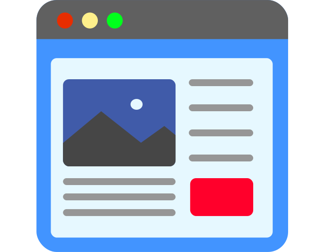

<a name="readme-top">Railsblog</a>

<div align="center">
  
  <br/>

  <h3><b></b></h3>

</div>

<!-- TABLE OF CONTENTS -->

# 📗 Table of Contents

- [� Table of Contents](#-table-of-contents)
- [📖 Railsblog ](#-railsblog-)
  - [🛠 Built With ](#-built-with-)
    - [Tech Stack ](#tech-stack-)
    - [Key Features ](#key-features-)
  - [💻 Getting Started ](#-getting-started-)
    - [Prerequisites](#prerequisites)
    - [Setup](#setup)
    - [Usage](#usage)
  - [👥 Authors ](#-authors-)
  - [🔭 Future Features ](#-future-features-)
  - [🤝 Contributing ](#-contributing-)
  - [⭐️ Show your support ](#️-show-your-support-)
  - [🙏 Acknowledgments ](#-acknowledgments-)
  - [📝 License ](#-license-)

# 📖 Railsblog <a name="about-project"></a>

**Railsblog** is a web app that will show the list of posts and empower readers to interact with them by adding comments and liking posts.

## 🛠 Built With <a name="built-with"></a>

### Tech Stack <a name="tech-stack"></a>

This project was implemented using:

<details>
  <summary>Client</summary>
  <ul>
    <li><a href="https://reactjs.org/">React.js</a></li>
  </ul>
</details>

<details>
  <summary>Server</summary>
  <ul>
    <li><a href="https://rubyonrails.org/">Ruby on Rails</a></li>
  </ul>
</details>

<details>
<summary>Database</summary>
  <ul>
    <li><a href="https://www.postgresql.org/">PostgreSQL</a></li>
  </ul>
</details>

### Key Features <a name="key-features"></a>

- **Can persist user data to database**
- **Can persist posts data to database**
- **Can persist comments and likes database**

<p align="right">(<a href="#readme-top">back to top</a>)</p>

## 💻 Getting Started <a name="getting-started"></a>

To get a local copy up and running, follow these steps:

### Prerequisites

In order to run this project you need to have installed:

- [ ] You’ll need to have Ruby and Rails on your machine.

Optionally, in order to modify this project you should to have installed:

- [ ] Git.

- [ ] Code editor like: [Visual Studio code](https://code.visualstudio.com/), [Sublime text](https://www.sublimetext.com/) or others...

### Setup

To clone this repository to your desired folder:

- You can download the **Zip** file from the GitHub repository, or clone the repository with:

```console
git clone git@github.com:GhislainMitahi/Railsblog.git
```

- Access the cloned directory with:

```console
cd Railsblog
```

- Open it with your favorite code editor or with the live server

### Usage

To run the project, execute the following command in the project directory:

```console
rails server
```

<p align="right">(<a href="#readme-top">back to top</a>)</p>

## 👥 Authors <a name="authors"></a>

👤 **GHislain Mitahi**

- GitHub: [@GhislainMitahi](https://github.com/GhislainMitahi)
- LinkedIn: [ghislainmitahi](https://www.linkedin.com/in/ghislain-mitahi/)

👤 **Biruk Bereka**

- GitHub: [@Biruk-Bereka](https://github.com/biruk-bereka)
- LinkedIn: [Biruk Bereka](https://www.linkedin.com/in/biruk-bereka1212/)

<p align="right">(<a href="#readme-top">back to top</a>)</p>

## 🔭 Future Features <a name="future-features"></a>

We will implement this on the future:

- [ ] **Users can login to blog app**
- [ ] **Users can add a post**
- [ ] **Users can see a post list**

<p align="right">(<a href="#readme-top">back to top</a>)</p>

## 🤝 Contributing <a name="contributing"></a>

Contributions, issues, and feature requests are welcome!

Feel free to check the [issues page](https://github.com/GhislainMitahi/Railsblog/issues).

<p align="right">(<a href="#readme-top">back to top</a>)</p>

## ⭐️ Show your support <a name="support"></a>

Give a ⭐️ if you like this project!

<p align="right">(<a href="#readme-top">back to top</a>)</p>

## 🙏 Acknowledgments <a name="acknowledgements"></a>

- Hat tip to anyone whose code was used.
- Thanks for all the curated content that was provided to us.
- Thanks to my learning and coding partners for all their support.

<p align="right">(<a href="#readme-top">back to top</a>)</p>

## 📝 License <a name="license"></a>

This project is [MIT](./LICENSE) licensed.

<p align="right">(<a href="#readme-top">back to top</a>)<
